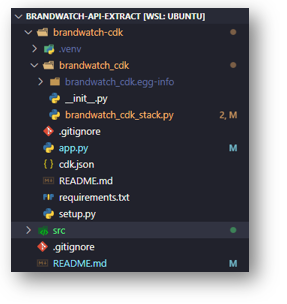

# Consumindo dados da API de Brandwatch com AWS Lambda


## Introdução

**O que é Brandwatch?**

Brandwatch é uma ferramenta de inteligência artificial para monitoramento de mídias sociais que busca interpretar e classificar menções dos usuários em diversos portais como Twitter, Instagram, Facebook, Blogs, portais de Notícias e etc.

**Sobre a API**

A API de Brandwatch é uma API páginada podendo trazer até cinco mil menções por requisição, permitindo 30 requisições a cada 10 minutos.

Nesse projeto utilizaremos a API do Brandwatch para extrair dados de menções sobre a marca, armazenando esses dados em ambiente de Data Lake onde será possível, por exemplo, disponibilizar serviços de monitoramento e gerenciamento de risco para os clientes sobre as menções da marca e entre outros estudos interessantes.

## O que utilizaremos?

**AWS CLI**

Utilizaremos o AWS CLI para gerenciar os serviços da AWS por linha de comando.

A instalação do pode ser feita seguindo a documentação da AWS: [AWS CLI](https://docs.aws.amazon.com/cli/latest/userguide/getting-started-install.html)

**AWS CDK**

O AWS CDK é um framework que utiliza linguagem de programação para definir os recursos na nuvem que queremos utilizar usando CloudFormation ou também Terraform. Visando torna os projetos mais dinâmicos a medida que é possível implementar lógica. A longo prazo conforme os projetos vão se tornando maiores, fica mais fácil dar manutenção, replicar modelos de infraestrutura e acelerar o ínicio de novos projetos.

Nesse projeto, utilizaremos o AWS CDK para provisionar o recurso de Lambda na AWS.

Todo o processo de preparação do ambiente do CDK pode ser encontrado nessa documentação da AWS:

[Get Started with AWS CDK](https://aws.amazon.com/getting-started/guides/setup-cdk/?nc1=h_ls)

## Iniciando o projeto de CDK

Primeiramente criaremos uma pasta vazia necessária para iniciar o projeto de CDK. Em seguida executaremos o comando:

```
cdk init app --language python
```

Como no exemplo abaixo:


O projeto vem com um ambiente virtual e com uma lista de dependências a ser instalada, então executaremos o comando para entrar no ambiente virtual:

```
source .venv/bin/activate
```

E em seguida instalaremos as dependencias utilizando o comando:

```
python -m pip install -r requirements.txt
```

Por final teremos essa estrutura do projeto:



Então o CDK gerou um módulo **brandwatch_cdk_stack.py** que possuí a classe **BrandwatchCdkStack**. Quando instanciamos essa classe estamos construindo uma Stack de recursos com o CloudFormation. Stacks são conjuntos de recursos que decidimos provisionar através um template do CloudFormation que nesse caso será construído através do CDK.

Pra provisionarmos o recurso de Lambda Function, precisamos antes importar o módulo de aws_lambda do CDK. Iremos instalar o módulo passando **aws_cdk.aws_lambda** para o **requirements.txt** e dentro da virtualenv executar o comando:

```
python -m pip install -r requirements.txt
```

Importando o módulo, iremos inserir no método **__init__** da classe **BrandwatchCdkStack** uma variavel que daremos o nome de **lambda_bw_api** que vai instanciar a classe **Function** do módulo **aws_lambda** passando os seguintes argumentos para os respectivos parametros:

- scope: parametro que recebe o Stack onde iremos fazer o deploy da Lambda Function, no caso a própria BrandwatchCdkStack, então passaremos como argumento somente: self;

- id: recebe uma string com o nome que daremos para o recurso dentro do CloudFormation onde passaremos: BrandwatchAPIExtract;

- runtime: passaremos o runtime do Python 3.8 que vem do módulo aws_lambda dessa forma: 

    lambda_bw.Runtime.PYTHON_3_9

- timeout: recebe um objeto do tipo Duration. Usaremos o método minutes para definir o tempo máximo para timeout da função que será de 15 minutos - tempo máximo que uma Lambda pode rodar.

    Como na documentação de Runtime do módulo aws_lambda: [Runtime](
https://docs.aws.amazon.com/cdk/api/latest/python/aws_cdk.aws_lambda/Runtime.html#aws_cdk.aws_lambda.Runtime);

- code: recebe um objeto do tipo Code onde vamos usar o método from_asset pra apontar a pasta onde está código da nossa função Lambda. Então criamos uma pasta code no nível do módulo **brandwatch_cdk_stack.py** e dentro da pasta teremos o modulo com o código que faz as requisições para a API de Brandwatch e guarda os objetos JSON das requisições no Data Lake. Passaremos dessa forma:

    lambda_bw.Code.from_asset('brandwatch_cdk/code')

    Então tudo o que estiver dentro da pasta code vai ser usado para construção da Lambda.

- handler: passaremos o módulo **lambda_handler** que criamos e a função **handler** que será executada dessa forma:

    lambda_handler.handler

Mais propriedades da Function podem ser encontradas aqui na documentação do módulo **aws_lambda**: [Function](https://docs.aws.amazon.com/cdk/api/latest/python/aws_cdk.aws_lambda/Function.html)

