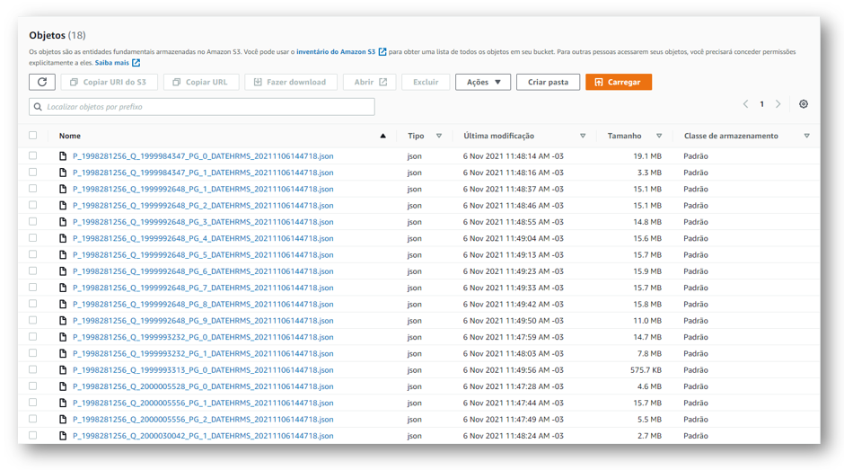

# Consumindo dados da API de Brandwatch com AWS Lambda


## Introdução

**O que é o Brandwatch?**

Brandwatch é uma ferramenta de inteligência artificial para monitoramento de mídias sociais que busca interpretar e classificar menções dos usuários em diversos portais como Twitter, Instagram, Facebook, Blogs, Portais de Notícias e etc.

**Sobre a API**

A API de Brandwatch é uma API páginada podendo trazer até cinco mil menções por requisição, permitindo 30 requisições a cada 10 minutos.

Nesse projeto utilizaremos a API do Brandwatch para extrair dados de menções sobre as marcas, armazenando esses dados em ambiente de Data Lake onde será possível com esses dados, por exemplo, disponibilizar serviços de monitoramento de mídias sociais e de gerenciamento de risco de menções sobre a marca e entre outros estudos interessantes.

## O que utilizaremos?

**AWS CLI**


Utilizaremos o AWS CLI para gerenciar alguns serviços da AWS por linha de comando.

A instalação pode ser feita seguindo a documentação da AWS: [AWS CLI](https://docs.aws.amazon.com/cli/latest/userguide/getting-started-install.html)

**AWS CDK + CloudFormation**

<p float="left">


</p>

O AWS CDK é um framework que utiliza linguagem de programação para construir templates YAML com fins de provisionar recursos na nuvem usando infraestrura como código através do CloudFormation também é possível utiliza-lo com Terraform.
A longo prazo conforme os projetos crescem, utilizar a IaC torna mais fácil futuramente dar manutenção, replicar modelos de infraestrutura e acelerar o ínicio de novos projetos.

Nesse projeto, utilizaremos o AWS CDK para provisionar os recursos de Lambda e S3.

Todo o processo de preparação do ambiente de CDK pode ser encontrado nessa documentação da AWS:

[Get Started with AWS CDK](https://aws.amazon.com/getting-started/guides/setup-cdk/?nc1=h_ls)

**AWS LAMBDA**


A AWS Lambda é um serviço serveless (sem necessidade de provisionar servidores) com a vantagem dos custo sob demanda somente pelo tempo em que a função permanece rodando (no máximo 15 minutos) e os recursos utilizados para otimizar o desempenho da Lambda.

Utilizaremos a AWS Lambda para executar nosso módulo que faz as requisições para a API de Brandwatch usando a biblioteca requests do Python.

**AWS S3**


AWS S3 é um serviço de armazenamento de objetos divido em buckets. Onde será dada a carga dos dados que vem da API de Brandwatch e que carregaremos na camada de Landing Zone do nosso Data Lake.

## Iniciando o projeto de CDK

Primeiramente criaremos uma pasta vazia, necessária para iniciar o projeto de CDK. Em seguida executamos o comando:

```
cdk init app --language python
```


O projeto vem com um ambiente virtual e com uma lista de dependências a ser instalada, então executamos o comando abaixo para entrar no ambiente virtual:

```
source .venv/bin/activate
```

Em seguida instalaremos as dependencias utilizando o comando:

```
python -m pip install -r requirements.txt
```

Por fim teremos essa estrutura do projeto de CDK:


Então agora que o CDK gerou um módulo **brandwatch_cdk_stack.py** que possuí a classe **BrandwatchCdkStack**.

Quando instanciamos essa classe estamos construindo uma Stack de recursos que passaremos para o CloudFormation. As Stacks são conjuntos de recursos que queremos provisionar através de um template YAML de CloudFormation, que nesse caso será construído através do CDK.

Pra provisionarmos o recurso de Lambda Function, precisamos antes importar o módulo de aws_lambda do CDK. Iremos instalar o módulo passando **aws_cdk.aws_lambda** para o **requirements.txt** e dentro da virtualenv executar o comando:

```
python -m pip install -r requirements.txt
```

Importando o módulo, iremos inserir no método **__init__** da classe **BrandwatchCdkStack** uma variável que daremos o nome de **lambda_bw_api** que vai instanciar a classe **Function** do módulo **aws_lambda** passando os seguintes argumentos para os respectivos parametros:

- scope: parametro que recebe o Stack onde iremos fazer o deploy da Lambda Function, no caso a própria BrandwatchCdkStack, então passaremos como argumento somente: self;

- id: recebe uma string com o nome que daremos para o recurso dentro do CloudFormation onde passaremos: BrandwatchAPIExtract;

- runtime: passaremos o runtime do Python 3.9 que vem da classe Runtime dessa forma:

    lambda_bw.Runtime.PYTHON_3_9

    Como na documentação de Runtime do módulo aws_lambda: [Runtime](
https://docs.aws.amazon.com/cdk/api/latest/python/aws_cdk.aws_lambda/Runtime.html#aws_cdk.aws_lambda.Runtime);

- timeout: recebe um objeto do tipo Duration. Usaremos o método minutes para definir o tempo máximo de timeout para a função, que será de 15 minutos - tempo máximo que uma Lambda pode rodar.


- code: recebe um objeto do tipo Code onde vamos usar o método from_asset pra apontar a pasta onde está código da nossa função Lambda. Então criamos uma pasta code no nível do módulo **brandwatch_cdk_stack.py** e dentro da pasta teremos o modulo com o código que faz as requisições para a API de Brandwatch e guarda os objetos JSON das requisições no Data Lake. Passaremos dessa forma:

    lambda_bw.Code.from_asset('brandwatch_cdk/code')

    Então tudo o que estiver dentro da pasta code vai ser usado para construção da nossa Lambda Function.

- handler: passaremos o módulo **lambda_handler** que criamos e a função **handler** que será executada dessa forma:

    lambda_handler.handler

- inicial_policy: Aqui declaramos as politicas inicias da função, passando como argumento um array de políticas que vai dar permissão para a Lambda fazer operações no Bucket do S3 com uma lista de ações, no caso aqui, passaremos somente a s3:PutObject e uma lista de ARNs (Amazon Recurse Names) do S3 com o nome do Bucket e acesso recursivo em todas as pastas do Bucket. Dessa forma:

    [bw_iam.PolicyStatement(actions = "s3:PutObject", ['arn:aws:s3:::data-lake-brandtest/*'])]

- memory_size: iremos atribuir 512, pois somente 128mb a função acaba incorrendo em timeout por conta da quantidade de dados.

No final o objeto instanciado na lambda_bw_api ficará dessa forma:


Mais propriedades da classe Function podem ser encontradas aqui na documentação do módulo **aws_lambda**: [Function](https://docs.aws.amazon.com/cdk/api/latest/python/aws_cdk.aws_lambda/Function.html)

## Provisionando um Bucket S3 para Data Lake

Também iremos criar um Bucket S3 que terá uma camada de landing zone para a ingestão dos dados brutos da API.

Precisamos então importar o módulo **aws_s3** usando a classe **Bucket** que atribuiremos a variável **bucket_data_lake**, usaremos aqui os seguintes parametros:

- scope, id: com as mesma finalidades da Function;

- bucket_name: onde passaremos uma string com o nome do bucket: brandwatch-mentions-test;

- block_public_access: vamos usar a classe BlockPublicAccess restringindo o acesso público usando o parametro restrict_public_buckets como True;

Ficando dessa forma:


Feito isso podemos sintetizar o código YAML do template executando o comando:

```
cdk synth
```

E teremos a saída do arquivo YAML que usaremos para fazer o deploy na CloudFormation .

Imagem de parte do arquivo para exemplo:


Para fazer o deploy, temos que ter um perfil de usuário configurado com as credenciais da AWS utilizando o **AWS CLI**. Em seguida, exportar o perfil de usuário para a variável de ambiente **AWS_PROFILE** como na imagem abaixo:


Para isolarmos o que é recurso CloudFormation do que não faz parte do CloudFormation - por exemplo o módulo das requisições para a API e os pacotes utilizados - precisaremos executar o comando:

```
cdk bootstrap
```


Para relizar o deploy da Lambda, executamos o comando:

```
cdk deploy
```


No console do CloudFormation podemos então olhar a Stack de recursos que criamos e ver todos os recursos provisionados com o AWS CDK:


Agora, testando a função Lambda, podemos ver que os dados de menções foram carregados na camada de landing zone do Data Lake no S3:




Como os dados desse projeto é utilizado em um projeto real que faz as extrações pela ferramenta Pentaho, a extração foi feita para fins de aprendizado e está utilizando dados reais e estratégicos de négocio. Então podemos desfazer todo o projeto utilizando o comando:

```
cdk destroy
```
E isso irá desfazer toda a Stack de recursos que provisionamos na AWS.


Por fim, o código do modulo que é executado pela Lambda para fazer as requisões para a API de Brandwatch está nesse link: [bw_requests.py](https://github.com/macielf1994/brandwatch-api-extract/blob/master/brandwatch-cdk/brandwatch_cdk/code/bw_requests.py)